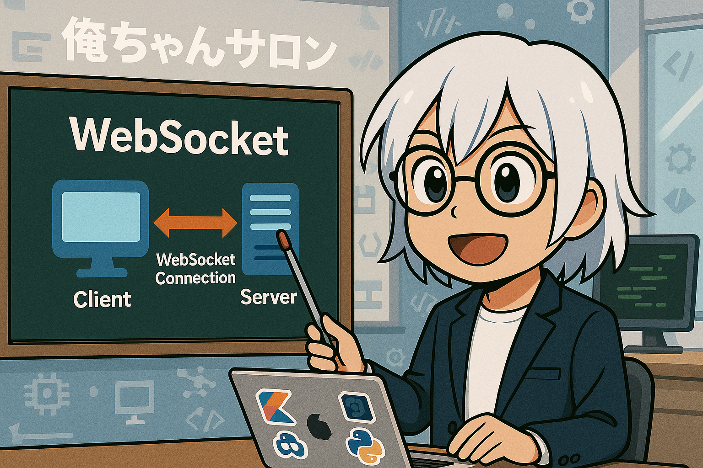

### WebSocketとは？
WebSocketは、双方向通信を可能にする通信プロトコルです。クライアント（例: Webブラウザ）とサーバー間で、持続的な接続を確立し、リアルタイムでデータを送受信することができます。HTTPのようにリクエストとレスポンスの繰り返しではなく、一度接続が確立されると、双方が自由にデータを送信できます。

---

### どのようなケースで使う？
WebSocketは、リアルタイム性が求められる以下のようなケースで使用されます：
- **チャットアプリケーション**（例: Slack, Discord）
- **リアルタイム通知**（例: 株価やスポーツのスコア更新）
- **オンラインゲーム**（例: マルチプレイヤーゲーム）
- **コラボレーションツール**（例: Google Docsのリアルタイム編集）
- **IoTデバイスとの通信**（例: センサーやスマートデバイスのデータ送受信）

---

### プロトコルはHTTPと違う？
はい、WebSocketはHTTPとは異なるプロトコルです。ただし、WebSocket接続は最初にHTTPを使用してハンドシェイクを行い、その後、WebSocketプロトコルに切り替わります。

#### 主な違い：
1. **通信モデル**:
    - HTTP: リクエスト/レスポンス型（クライアントがリクエストを送信し、サーバーが応答）
    - WebSocket: 双方向通信（クライアントとサーバーが自由にデータを送受信）

2. **接続の持続性**:
    - HTTP: 通常、リクエストごとに接続を開閉
    - WebSocket: 接続を維持し続ける

3. **プロトコルのレイヤー**:
    - HTTP: アプリケーション層プロトコル
    - WebSocket: 独自のプロトコル（TCP上で動作）

4. **ヘッダーのオーバーヘッド**:
    - HTTP: 各リクエスト/レスポンスにヘッダーが付与される
    - WebSocket: 一度接続が確立されると、ヘッダーのオーバーヘッドが少ない

WebSocketは、リアルタイム性や効率性が求められるアプリケーションに適していますが、HTTPは汎用的な通信に適しています。